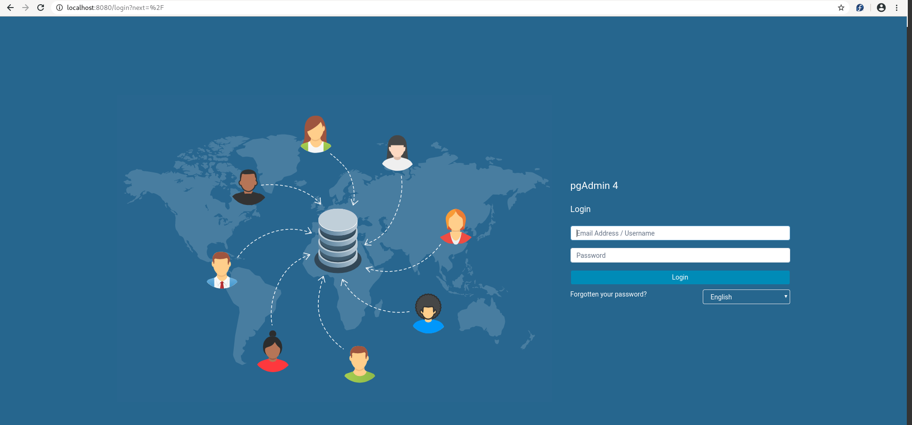

# docker-compose-postgres-pgadmin4

## Requirements:
- docker
- docker-compose

## Quick Start
- Clone this repository
- Go to directory,  `cd docker-compose-postgres`
- Run this command `docker-compose -f docker-compose-postgres-pgadmin4.yml up -d`


## Environment Variables

- `POSTGRES_USER` the default value is **postgres**
- `POSTGRES_PASSWORD` the default value is **passw0rd**
- `PGADMIN_PORT` the default value is **8080**
- `PGADMIN_DEFAULT_EMAIL` the default value is **shamim.rhce@gmail.com**
- `PGADMIN_DEFAULT_PASSWORD` the default value is **passw0rd**

## Access to postgres: 
- `localhost:5432`
- **Username:** postgres (as a default)
- **Password:** passw0rd (as a default)

## Access to postgres using terminal:
```
docker exec -it postgres psql -U postgres
```
## Access to PgAdmin: 
- **URL:** `http://localhost:8080`
- **Username:** shamim.rhce@gmail.com (as a default)
- **Password:** passw0rd (as a default)


## Add a new server in PgAdmin:
- **Host name/address** `postgres`
- **Port** `5432`
- **Username** as `POSTGRES_USER`, by default: `postgres`
- **Password** as `POSTGRES_PASSWORD`, by default `passw0rd`
