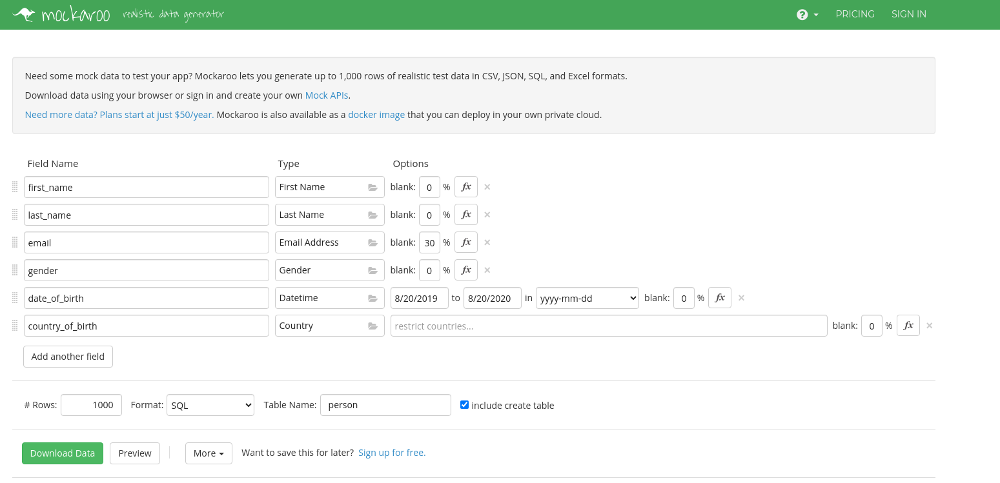
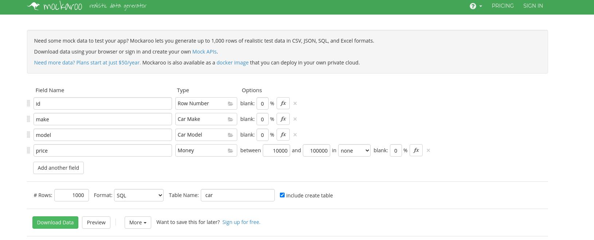

**Connect database container**
```
docker exec -it postgres psql -U postgres
[sakhtar@linux docker-compose-postgres]$ docker exec -it postgres psql -U postgres
psql (12.4)
Type "help" for help.

postgres=# 
```

**List Database**
```
postgres=# \l
                                 List of databases
   Name    |  Owner   | Encoding |  Collate   |   Ctype    |   Access privileges   
-----------+----------+----------+------------+------------+-----------------------
 postgres  | postgres | UTF8     | en_US.utf8 | en_US.utf8 | 
 shamim    | postgres | UTF8     | en_US.utf8 | en_US.utf8 | 
 template0 | postgres | UTF8     | en_US.utf8 | en_US.utf8 | =c/postgres          +
           |          |          |            |            | postgres=CTc/postgres
 template1 | postgres | UTF8     | en_US.utf8 | en_US.utf8 | =c/postgres          +
           |          |          |            |            | postgres=CTc/postgres
(4 rows)

postgres=# 

```
**Create Database**
```
postgres=# CREATE DATABASE test;
CREATE DATABASE
postgres=# 

```
**Drop Database**
```
postgres=# DROP DATABASE test;
CREATE DATABASE
postgres=# 

```
**Connect to Database test**
```
postgres=# \c test
You are now connected to database "test" as user "postgres".
test=# 
```
**Clear the screeen in posgres prompt**

```
\! clear
```

**Create Table person **
```
 CREATE TABLE person (
  first_name VARCHAR(50),
  last_name VARCHAR(50),
  gender VARCHAR(7),
  date_of_birth DATE
);
```

**List Table**
```
postgres=# \d
 public | person | table | postgres

postgres=# 

```

**Describe Table**
```
postgres=# \d person;
 first_name    | character varying(50) |           |          | 
 last_name     | character varying(50) |           |          | 
 gender        | character varying(7)  |           |          | 
 date_of_birth | date                  |           |          | 

postgres=#
```

**Drop Table**
```
DROP TABLE person;
```

**Create Table with constraints**
```
CREATE TABLE person (
   id BIGSERIAL NOT NULL PRIMARY KEY,
   first_name VARCHAR(50) NOT NULL,
   last_name VARCHAR(50) NOT NULL,
   gender VARCHAR(5) NOT NULL,
   date_of_birth DATE NOT NULL,
   email VARCHAR(150)
);
```

**Insert into the table**
```
postgres=# INSERT INTO person (first_name, last_name, gender, date_of_birth) VALUES('Shamim', 'Akhtar', 'Male', '1987-12-02');


postgres=# INSERT INTO person (first_name, last_name, gender, date_of_birth) VALUES('Ali', 'Raza', 'Male', '1984-01-12');


postgres=# INSERT INTO person (first_name, last_name, gender, date_of_birth, email) VALUES('Amir', 'Khan', 'Male', '1986-01-12', 'amirkhan@gmail.com');


postgres=# select * from person;
  1 | Shamim     | Akhtar    | Male   | 1987-12-02    | 
  2 | Ali        | Raza      | Male   | 1984-01-12    | 
  3 | Amir       | Khan      | Male   | 1986-01-12    | amirkhan@gmail.com

postgres=# 
```

**Create mock data**

Create mock data from [here](https://www.mockaroo.com/) as given below and download person.sql


**How to populate sql data to postgres docker container**

Find the name and id of the Docker container hosting the Postgres instance
```
[sakhtar@linux ~]$ docker ps
CONTAINER ID        IMAGE                  COMMAND                  CREATED             STATUS              PORTS                           NAMES
91865223f3e7        dpage/pgadmin4:4.24    "/entrypoint.sh"         19 seconds ago      Up 17 seconds       443/tcp, 0.0.0.0:8080->80/tcp   pgadmin
c4a425bb92c1        postgres:12.4-alpine   "docker-entrypoint.s…"   19 seconds ago      Up 17 seconds       0.0.0.0:5432->5432/tcp          postgres
```

Find the volumes available in the Docker container

```
docker inspect -f '{{ json .Mounts }}' <container_id> | python -m json.tool

[sakhtar@linux ~]$ docker inspect -f '{{ json .Mounts }}' c4a425bb92c1 | python -m json.tool
[
    {
        "Destination": "/var/lib/postgresql/data",
        "Driver": "local",
        "Mode": "rw",
        "Name": "docker-compose-postgres_postgres",
        "Propagation": "",
        "RW": true,
        "Source": "/var/lib/docker/volumes/docker-compose-postgres_postgres/_data",
        "Type": "volume"
    }
]
[sakhtar@linux ~]$
```
In this case, we have /var/lib/postgresql/data as the volume path.

Copy dump into one of the volumes

```
docker cp ./SQL/person.sql postgres:/var/lib/postgresql/data/
```

Now populate sql from postgres cli

```
postgres=# \i /var/lib/postgresql/data/person.sql;
```
****

**SQL Select From**


**Order by**

**Distinct**

**Where Clause and AND**


**Comparison Operators**

**Limit, Offset & Fetch**

**IN**


**Between**
```
test=# SELECT * FROM person WHERE date_of_birth BETWEEN DATE '2019-01-01' AND '2019-12-31';
 id  | first_name |  last_name  |               email               | gender | date_of_birth | country_of_birth 
-----+------------+-------------+-----------------------------------+--------+---------------+------------------
 131 | Marybeth   | Coverley    | mcoverley3m@yale.edu              | Female | 2019-02-28    | Philippines
 164 | Laurianne  | Ferier      | lferier4j@de.vu                   | Female | 2019-02-17    | Portugal
 251 | Catriona   | Tatershall  | ctatershall6y@acquirethisname.com | Female | 2019-11-19    | Russia
 274 | Concettina | Nan Carrow  | cnancarrow7l@newsvine.com         | Female | 2019-06-30    | China
 296 | Marv       | MacCathay   | mmaccathay87@imageshack.us        | Male   | 2019-02-01    | Afghanistan
 316 | Eleanor    | Wasielewicz | ewasielewicz8r@usnews.com         | Female | 2019-07-08    | Indonesia
 423 | Gabe       | Tollerfield | gtollerfieldbq@java.com           | Male   | 2019-10-14    | Russia
 543 | Idelle     | Burgane     | iburganef2@skype.com              | Female | 2019-06-05    | Vietnam
 579 | Rogerio    | Daine       | rdaineg2@gizmodo.com              | Male   | 2019-04-23    | Philippines
 638 | Allayne    | Rowlstone   | arowlstonehp@hatena.ne.jp         | Male   | 2019-04-03    | Thailand
 710 | Ramona     | Kidstone    | rkidstonejp@aol.com               | Female | 2019-04-14    | South Africa
 762 | Birch      | Tebb        | btebbl5@mozilla.com               | Male   | 2019-09-16    | Indonesia
 826 | Darcie     | Verdie      | dverdiemx@bing.com                | Female | 2019-01-25    | Switzerland
 887 | Kerk       | Geraldini   | kgeraldiniom@ucoz.com             | Male   | 2019-10-29    | Ukraine
 968 | Brande     | Goulbourne  | bgoulbourneqv@un.org              | Female | 2019-12-06    | Indonesia
(15 rows)

```
**Like**
```
test=# SELECT * FROM person WHERE email LIKE '%xing.com';
 id  | first_name | last_name |         email         | gender | date_of_birth | country_of_birth 
-----+------------+-----------+-----------------------+--------+---------------+------------------
  41 | Jere       | Bosward   | jbosward14@xing.com   | Male   | 1981-11-22    | Poland
 646 | Bethanne   | Patek     | bpatekhx@xing.com     | Female | 2010-05-09    | United States
 668 | Tine       | Carbonell | tcarbonellij@xing.com | Female | 2005-09-14    | Poland
 798 | Valry      | Smither   | vsmitherm5@xing.com   | Female | 1950-01-06    | Indonesia
 863 | Gabby      | Sharpe    | gsharpeny@xing.com    | Male   | 1951-06-16    | Norway
(5 rows)

test=# 
```
```
test=# SELECT * FROM person WHERE email LIKE '%@google.com';
 id  | first_name | last_name |         email         | gender | date_of_birth | country_of_birth 
-----+------------+-----------+-----------------------+--------+---------------+------------------
 284 | Jasmine    | Minshaw   | jminshaw7v@google.com | Female | 2013-05-15    | China
(1 row)

test=# SELECT * FROM person WHERE email LIKE '%@google.%';
 id  |  first_name  |   last_name    |              email              | gender | date_of_birth |  country_of_birth  
-----+--------------+----------------+---------------------------------+--------+---------------+--------------------
  10 | Charmian     | Lambell        | clambell9@google.com.hk         | Female | 1992-12-31    | Ukraine
  17 | Galen        | Wankling       | gwanklingg@google.com.au        | Male   | 1950-08-12    | China
 100 | Leroi        | Leivers        | lleivers2r@google.co.uk         | Male   | 2003-08-10    | Malaysia
 105 | Marie-jeanne | Kopp           | mkopp2w@google.it               | Female | 1948-09-01    | Indonesia
 146 | Derby        | Biddle         | dbiddle41@google.co.uk          | Male   | 1999-02-20    | Indonesia
 176 | Danyette     | Linskey        | dlinskey4v@google.pl            | Female | 2005-01-09    | South Korea
 202 | Clary        | Brawley        | cbrawley5l@google.de            | Female | 2004-09-17    | China
 230 | Zahara       | Burchett       | zburchett6d@google.com.au       | Female | 1977-08-20    | China
 263 | Deeyn        | Thackray       | dthackray7a@google.es           | Female | 1969-08-13    | Sweden
 284 | Jasmine      | Minshaw        | jminshaw7v@google.com           | Female | 2013-05-15    | China
 287 | Sidnee       | Paulou         | spaulou7y@google.it             | Male   | 1994-06-27    | China
 321 | Joceline     | Baine          | jbaine8w@google.co.jp           | Female | 1956-01-28    | Argentina
 330 | Conrado      | Leeke          | cleeke95@google.pl              | Male   | 2020-05-25    | Indonesia
 387 | Eduino       | Poundsford     | epoundsfordaq@google.fr         | Male   | 1970-03-25    | Philippines
 427 | George       | Lune           | glunebu@google.ca               | Male   | 1988-02-24    | Chile
 470 | Poppy        | Whiskerd       | pwhiskerdd1@google.com.br       | Female | 1975-04-22    | United States
 584 | Sergei       | Mustin         | smusting7@google.pl             | Male   | 1997-02-05    | Ukraine
 593 | Sinclare     | Jimson         | sjimsongg@google.fr             | Male   | 1995-12-26    | Indonesia
 610 | Phillie      | Fearnill       | pfearnillgx@google.com.hk       | Female | 1976-10-09    | China
 612 | Danika       | aManger        | damangergz@google.es            | Female | 2000-01-26    | United States
 669 | Budd         | Rodger         | brodgerik@google.pl             | Male   | 1973-07-09    | Greece
 678 | Leah         | Lidyard        | llidyardit@google.ca            | Female | 2020-01-27    | Vietnam
 694 | Vassily      | Alelsandrovich | valelsandrovichj9@google.com.au | Male   | 1979-07-04    | Sweden
 695 | Mendie       | Cambden        | mcambdenja@google.co.jp         | Male   | 2020-04-12    | Honduras
 728 | Archambault  | Demcik         | ademcikk7@google.es             | Male   | 2010-11-11    | Brazil
 732 | Belia        | Nortcliffe     | bnortcliffekb@google.ru         | Female | 2005-08-04    | Dominican Republic
 742 | Meier        | Girke          | mgirkekl@google.ca              | Male   | 1948-10-07    | Portugal
 752 | Darrell      | Ciobutaro      | dciobutarokv@google.it          | Male   | 1973-07-07    | China
 916 | Mallissa     | Mangan         | mmanganpf@google.com.br         | Female | 1997-11-14    | Poland
 936 | Francoise    | Filchakov      | ffilchakovpz@google.de          | Female | 2006-01-16    | Azerbaijan
 942 | Herc         | Ruit           | hruitq5@google.co.uk            | Male   | 2005-02-18    | Serbia
 967 | Hatty        | Martynka       | hmartynkaqu@google.nl           | Female | 2002-04-24    | Bahrain
 979 | Goraud       | Vaudrey        | gvaudreyr6@google.cn            | Male   | 1958-04-25    | Canada
 981 | Ogdon        | Bosley         | obosleyr8@google.pl             | Male   | 1949-04-11    | France
(34 rows)

test=# 
```
**Single character with underscore (_)**
```
test=# SELECT * FROM person WHERE email LIKE '______@%';
 id  | first_name | last_name |           email            | gender | date_of_birth | country_of_birth 
-----+------------+-----------+----------------------------+--------+---------------+------------------
  15 | Armando    | Hume      | ahumee@topsy.com           | Male   | 2001-04-30    | Ukraine
  30 | Lorens     | Kirk      | lkirkt@eepurl.com          | Male   | 2013-10-15    | Indonesia
 239 | Jerrine    | Say       | jsay6m@hubpages.com        | Female | 1965-08-12    | United States
 261 | Gerardo    | Axe       | gaxe78@va.gov              | Male   | 2015-05-10    | Kuwait
 295 | Carmel     | Esh       | cesh86@pinterest.com       | Female | 1959-12-02    | Sweden
 341 | Enos       | Odo       | eodo9g@naver.com           | Male   | 1968-04-11    | Russia
 436 | Emiline    | Yon       | eyonc3@opera.com           | Female | 2003-10-15    | Sweden
 693 | Noami      | Raw       | nrawj8@cdc.gov             | Female | 1979-12-30    | Luxembourg
 823 | Chan       | Mix       | cmixmu@guardian.co.uk      | Male   | 1949-03-21    | Indonesia
 868 | Leanora    | Roe       | lroeo3@bing.com            | Female | 1951-01-21    | Poland
 975 | Elisabet   | Dix       | edixr2@cargocollective.com | Female | 1965-04-04    | Brazil
(11 rows)

test=# 
```
**iLike**
```
test=# SELECT * FROM person WHERE country_of_birth LIKE 'a%';
 id | first_name | last_name | email | gender | date_of_birth | country_of_birth 
----+------------+-----------+-------+--------+---------------+------------------
(0 rows)

test=# SELECT * FROM person WHERE country_of_birth ILIKE 'a%';
 id  | first_name | last_name  |             email              | gender | date_of_birth | country_of_birth 
-----+------------+------------+--------------------------------+--------+---------------+------------------
   5 | Isaiah     | Titmuss    | ititmuss4@epa.gov              | Male   | 2015-04-25    | Albania
  26 | Jacquelyn  | Mowat      | jmowatp@blinklist.com          | Female | 1960-07-23    | Albania
  34 | Thaine     | Oades      | toadesx@cpanel.net             | Male   | 1964-03-04    | Argentina
  49 | Lorita     | Allcoat    | lallcoat1c@unblog.fr           | Female | 1998-04-02    | Argentina
  81 | Minni      | Roocroft   | mroocroft28@thetimes.co.uk     | Female | 2004-12-17    | Armenia
  85 | Lalo       | Alden      | lalden2c@nymag.com             | Male   | 2007-07-13    | Argentina
 214 | Ramon      | Grafom     | rgrafom5x@indiegogo.com        | Male   | 2005-01-26    | Argentina
 255 | Effie      | Kluss      | ekluss72@phoca.cz              | Female | 2005-04-01    | Angola
 291 | John       | Reace      | jreace82@taobao.com            | Male   | 1960-09-13    | Albania
 296 | Marv       | MacCathay  | mmaccathay87@imageshack.us     | Male   | 2019-02-01    | Afghanistan
 297 | Burty      | Bester     | bbester88@ezinearticles.com    | Male   | 1953-11-21    | Argentina
 304 | Charo      | Loxdale    | cloxdale8f@drupal.org          | Female | 1997-12-08    | Argentina
 321 | Joceline   | Baine      | jbaine8w@google.co.jp          | Female | 1956-01-28    | Argentina
 384 | Obidiah    | Dallemore  | odallemorean@hostgator.com     | Male   | 2005-04-27    | Afghanistan
 521 | Wallis     | Gravenell  | wgravenelleg@yolasite.com      | Female | 1965-11-02    | Afghanistan
 550 | Herbie     | Gummie     | hgummief9@spiegel.de           | Male   | 2013-10-04    | Argentina
 553 | Chev       | Rutigliano | crutiglianofc@newyorker.com    | Male   | 1964-05-07    | Argentina
 664 | Dionne     | Costy      | dcostyif@discuz.net            | Female | 1960-09-24    | Argentina
 670 | Cobb       | Rawlin     | crawlinil@jalbum.net           | Male   | 1992-02-21    | Armenia
 714 | Franni     | Proger     | fprogerjt@tamu.edu             | Female | 1949-08-07    | Afghanistan
 736 | Shirline   | Chaloner   | schalonerkf@sfgate.com         | Female | 1999-02-02    | Azerbaijan
 763 | Egor       | Clemes     | eclemesl6@hubpages.com         | Male   | 1999-08-03    | Argentina
 816 | Kennett    | Lembrick   | klembrickmn@amazon.co.uk       | Male   | 1982-11-18    | Afghanistan
 878 | Dorey      | Hunnicot   | dhunnicotod@wikipedia.org      | Female | 1948-12-18    | Argentina
 883 | Alikee     | Itzakson   | aitzaksonoi@bbc.co.uk          | Female | 2016-11-21    | Argentina
 886 | Crichton   | Girth      | cgirthol@opera.com             | Male   | 1989-08-14    | Argentina
 905 | Taddeo     | Staveley   | tstaveleyp4@simplemachines.org | Male   | 1994-10-25    | Afghanistan
 930 | Lindon     | Goldie     | lgoldiept@dmoz.org             | Male   | 1982-06-04    | Afghanistan
 936 | Francoise  | Filchakov  | ffilchakovpz@google.de         | Female | 2006-01-16    | Azerbaijan
 938 | Cecilia    | Bambury    | cbamburyq1@imgur.com           | Female | 2006-05-12    | Argentina
 952 | Silvano    | Commuzzo   | scommuzzoqf@accuweather.com    | Male   | 1995-03-28    | Argentina
 970 | Andres     | Rumbold    | arumboldqx@ibm.com             | Male   | 1978-09-14    | Armenia
 983 | Mina       | Alcorn     | malcornra@redcross.org         | Female | 2001-08-31    | Armenia
(33 rows)

test=# 
```
**Group By**
```
test=# SELECT country_of_birth, count(*) FROM person GROUP BY country_of_birth;
         country_of_birth         | count 
----------------------------------+-------
 Bangladesh                       |     3
 Indonesia                        |   115
 Venezuela                        |     7
 Luxembourg                       |     3
 Czech Republic                   |    14
 Sweden                           |    29
 Uganda                           |     5
 Jordan                           |     2
 Dominican Republic               |     4
 Ireland                          |     3
 Macedonia                        |     1
 Papua New Guinea                 |     1
 Sri Lanka                        |     1
 Uzbekistan                       |     5
 Finland                          |     2
 Portugal                         |    37
 Malta                            |     1
 Colombia                         |    19
 Albania                          |     3
 Saudi Arabia                     |     3
 Ukraine                          |    17
 Cuba                             |     4
 Latvia                           |     3
 North Korea                      |     1
 Kyrgyzstan                       |     2
 France                           |    25
 Cape Verde                       |     1
 Maldives                         |     1
 Israel                           |     4
 Kenya                            |     1
 Ghana                            |     1
 Senegal                          |     1
 Malaysia                         |     5
 Zambia                           |     1
 Madagascar                       |     2
 Kuwait                           |     1
 Sierra Leone                     |     1
 Bosnia and Herzegovina           |     7
 Philippines                      |    50
 Benin                            |     1
 United States                    |    25
 Guinea                           |     1
 Nigeria                          |     5
 Tajikistan                       |     1
 Comoros                          |     1
 China                            |   163
 New Caledonia                    |     2
 Belarus                          |     3
 Armenia                          |     4
 Netherlands                      |     1
 Serbia                           |     5
 Mauritius                        |     5
 Angola                           |     1
 Bahrain                          |     1
 Vanuatu                          |     1
 Spain                            |     3
 Georgia                          |     1
 Malawi                           |     2
 Belgium                          |     1
 Democratic Republic of the Congo |     3
 Bhutan                           |     1
 Thailand                         |    10
 El Salvador                      |     1
 United Kingdom                   |     6
 Germany                          |     2
 Canada                           |    10
 South Korea                      |     7
 Argentina                        |    16
 Azerbaijan                       |     2
 Slovenia                         |     2
 Egypt                            |     2
 Greece                           |    13
 Afghanistan                      |     7
 Chad                             |     1
 Iran                             |     2
 Chile                            |     7
 Gambia                           |     1
 Estonia                          |     1
 Vietnam                          |     9
 South Africa                     |     7
 Peru                             |    22
 Kazakhstan                       |     2
 Japan                            |    15
 Ivory Coast                      |     1
 Denmark                          |     1
 Mongolia                         |     3
 Mauritania                       |     1
 Switzerland                      |     1
 Ecuador                          |     2
 New Zealand                      |     4
 Hungary                          |     3
 Russia                           |    67
 Norway                           |     4
 Honduras                         |     5
 Pakistan                         |     6
 Brazil                           |    41
 Guatemala                        |     2
 Guinea-Bissau                    |     1
 Bolivia                          |     3
 Ethiopia                         |     2
 Niger                            |     1
 Panama                           |     2
 Yemen                            |     4
 Bulgaria                         |     3
 Turkmenistan                     |     1
 Croatia                          |     3
 Tunisia                          |     3
 Sudan                            |     3
 Morocco                          |     1
 Moldova                          |     3
 Myanmar                          |     3
 Nicaragua                        |     2
 Mexico                           |     8
 Tanzania                         |     5
 Palestinian Territory            |     7
 Poland                           |    39
 Costa Rica                       |     2
 Haiti                            |     1
(118 rows)

```

**Group By Having**
```
test=# SELECT country_of_birth, count(*) FROM person GROUP BY country_of_birth ORDER BY country_of_birth;
         country_of_birth         | count 
----------------------------------+-------
 Afghanistan                      |     7
 Albania                          |     3
 Angola                           |     1
 Argentina                        |    16
 Armenia                          |     4
 Azerbaijan                       |     2
 Bahrain                          |     1
 Bangladesh                       |     3
 Belarus                          |     3
 Belgium                          |     1
 Benin                            |     1
 Bhutan                           |     1
 Bolivia                          |     3
 Bosnia and Herzegovina           |     7
 Brazil                           |    41
 Bulgaria                         |     3
 Canada                           |    10
 Cape Verde                       |     1
 Chad                             |     1
 Chile                            |     7
 China                            |   163
 Colombia                         |    19
 Comoros                          |     1
 Costa Rica                       |     2
 Croatia                          |     3
 Cuba                             |     4
 Czech Republic                   |    14
 Democratic Republic of the Congo |     3
 Denmark                          |     1
 Dominican Republic               |     4
 Ecuador                          |     2
 Egypt                            |     2
 El Salvador                      |     1
 Estonia                          |     1
 Ethiopia                         |     2
 Finland                          |     2
 France                           |    25
 Gambia                           |     1
 Georgia                          |     1
 Germany                          |     2
 Ghana                            |     1
 Greece                           |    13
 Guatemala                        |     2
 Guinea                           |     1
 Guinea-Bissau                    |     1
 Haiti                            |     1
 Honduras                         |     5
 Hungary                          |     3
 Indonesia                        |   115
 Iran                             |     2
 Ireland                          |     3
 Israel                           |     4
 Ivory Coast                      |     1
 Japan                            |    15
 Jordan                           |     2
 Kazakhstan                       |     2
 Kenya                            |     1
 Kuwait                           |     1
 Kyrgyzstan                       |     2
 Latvia                           |     3
 Luxembourg                       |     3
 Macedonia                        |     1
 Madagascar                       |     2
 Malawi                           |     2
 Malaysia                         |     5
 Maldives                         |     1
 Malta                            |     1
 Mauritania                       |     1
 Mauritius                        |     5
 Mexico                           |     8
 Moldova                          |     3
 Mongolia                         |     3
 Morocco                          |     1
 Myanmar                          |     3
 Netherlands                      |     1
 New Caledonia                    |     2
 New Zealand                      |     4
 Nicaragua                        |     2
 Niger                            |     1
 Nigeria                          |     5
 North Korea                      |     1
 Norway                           |     4
 Pakistan                         |     6
 Palestinian Territory            |     7
 Panama                           |     2
 Papua New Guinea                 |     1
 Peru                             |    22
 Philippines                      |    50
 Poland                           |    39
 Portugal                         |    37
 Russia                           |    67
 Saudi Arabia                     |     3
 Senegal                          |     1
 Serbia                           |     5
 Sierra Leone                     |     1
 Slovenia                         |     2
 South Africa                     |     7
 South Korea                      |     7
 Spain                            |     3
 Sri Lanka                        |     1
 Sudan                            |     3
 Sweden                           |    29
 Switzerland                      |     1
 Tajikistan                       |     1
 Tanzania                         |     5
 Thailand                         |    10
 Tunisia                          |     3
 Turkmenistan                     |     1
 Uganda                           |     5
 Ukraine                          |    17
 United Kingdom                   |     6
 United States                    |    25
 Uzbekistan                       |     5
 Vanuatu                          |     1
 Venezuela                        |     7
 Vietnam                          |     9
 Yemen                            |     4
 Zambia                           |     1
(118 rows)

```
**Order by and having**
```
test=# SELECT country_of_birth, COUNT(*) FROM person GROUP BY country_of_birth HAVING COUNT(*) > 5 ORDER BY country_of_birth;
    country_of_birth    | count 
------------------------+-------
 Afghanistan            |     7
 Argentina              |    16
 Bosnia and Herzegovina |     7
 Brazil                 |    41
 Canada                 |    10
 Chile                  |     7
 China                  |   163
 Colombia               |    19
 Czech Republic         |    14
 France                 |    25
 Greece                 |    13
 Indonesia              |   115
 Japan                  |    15
 Mexico                 |     8
 Pakistan               |     6
 Palestinian Territory  |     7
 Peru                   |    22
 Philippines            |    50
 Poland                 |    39
 Portugal               |    37
 Russia                 |    67
 South Africa           |     7
 South Korea            |     7
 Sweden                 |    29
 Thailand               |    10
 Ukraine                |    17
 United Kingdom         |     6
 United States          |    25
 Venezuela              |     7
 Vietnam                |     9
(30 rows)

```
**Adding New Table And Data Using Mockaroo**


```
docker cp ./SQL/car.sql postgres:/var/lib/postgresql/data/
test=#\i /var/lib/postgresql/data/car.sql;
```
**Calculating Min, Max & Average**
```
test=# SELECT MAX(price) FROM car;
   max    
----------
 99977.77
(1 row)

test=# SELECT MIN(price) FROM car;
   min    
----------
 10004.02
(1 row)

test=# SELECT AVG(price) FROM car;
        avg         
--------------------
 54749.887760000000
(1 row)

test=# SELECT ROUND(AVG(price)) FROM car;
 round 
-------
 54750
(1 row)

test=# 
```
```
test=# SELECT make,model, MIN(price) FROM car GROUP BY make,model limit 5;
     make      |    model     |   min    
---------------+--------------+----------
 Dodge         | Dynasty      | 20122.52
 Pontiac       | GTO          | 13474.44
 Toyota        | Land Cruiser | 24105.78
 Mitsubishi    | Sigma        | 56004.23
 Mercedes-Benz | S-Class      | 12745.91
(5 rows)

test=#
```
```
SELECT make,model, MAX(price) FROM car GROUP BY make,model limit 5;
     make      |    model     |   max    
---------------+--------------+----------
 Dodge         | Dynasty      | 20122.52
 Pontiac       | GTO          | 84281.94
 Toyota        | Land Cruiser | 98970.85
 Mitsubishi    | Sigma        | 56004.23
 Mercedes-Benz | S-Class      | 88909.14
(5 rows)
```
```
SELECT make, MAX(price) FROM car GROUP BY make limit 5;
   make   |   max    
----------+----------
 Ford     | 99333.97
 Smart    | 11531.92
 Maserati | 87641.73
 Dodge    | 98636.05
 Infiniti | 95521.32
(5 rows)
```
**Sum**
```
test=# SELECT make,SUM(price) FROM car GROUP BY make limit 5;
   make   |    sum     
----------+------------
 Ford     | 5465482.91
 Smart    |   11531.92
 Maserati |  182099.15
 Dodge    | 2515519.58
 Infiniti |  966709.93
(5 rows)

```

**Basics of Arithmetic Operators**
```
test=# SELECT id,make,model,price, ROUND(price * .10,2) from car limit 5;
 id |   make    |     model     |  price   |  round  
----+-----------+---------------+----------+---------
  1 | Honda     | CR-V          | 54286.10 | 5428.61
  2 | Maybach   | 57            | 74847.63 | 7484.76
  3 | Chevrolet | Suburban 1500 | 62678.03 | 6267.80
  4 | Volvo     | S80           | 32832.14 | 3283.21
  5 | Hyundai   | Sonata        | 39201.07 | 3920.11
(5 rows)
```
 **Arithmetic Operators (ROUND)**
```
test=# SELECT id,make,model,price, ROUND(price * .10,2) AS "10% of price", ROUND(price - (price * .10),2) AS "Rest Amt after 10%" from car limit 5;
 id |   make    |     model     |  price   | 10% of price | Rest Amt after 10% 
----+-----------+---------------+----------+--------------+--------------------
  1 | Honda     | CR-V          | 54286.10 |      5428.61 |           48857.49
  2 | Maybach   | 57            | 74847.63 |      7484.76 |           67362.87
  3 | Chevrolet | Suburban 1500 | 62678.03 |      6267.80 |           56410.23
  4 | Volvo     | S80           | 32832.14 |      3283.21 |           29548.93
  5 | Hyundai   | Sonata        | 39201.07 |      3920.11 |           35280.96
(5 rows)

```
 **Alias**
```
test=# SELECT id AS "ID",make AS "MAKE",model AS "MODEL",price AS "PRICE", ROUND(price * .10,2) AS "10% Discount", ROUND(price - (price * .10),2) AS "Price after Discount" from car limit 5;
 ID |   MAKE    |     MODEL     |  PRICE   | 10% Discount | Price after Discount 
----+-----------+---------------+----------+--------------+----------------------
  1 | Honda     | CR-V          | 54286.10 |      5428.61 |             48857.49
  2 | Maybach   | 57            | 74847.63 |      7484.76 |             67362.87
  3 | Chevrolet | Suburban 1500 | 62678.03 |      6267.80 |             56410.23
  4 | Volvo     | S80           | 32832.14 |      3283.21 |             29548.93
  5 | Hyundai   | Sonata        | 39201.07 |      3920.11 |             35280.96
(5 rows
```
**Coalesce**
```
test=# SELECT COALESCE(email,'Email not provided')FROM person;
               coalesce               
--------------------------------------
 fprandin0@amazon.co.jp
 gscrase1@newyorker.com
 aashbe2@merriam-webster.com
 ceustanch3@stanford.edu
 rmcpartlin4@sciencedaily.com
 kpeeters5@youku.com
 Email not provided
 dfranscioni7@addtoany.com
 cdumelow8@pagesperso-orange.fr
 Email not provided
 dfreiberga@hhs.gov
 Email not provided
 vmiddlehurstc@virginia.edu
 dballochd@live.com
 Email not provided
 rcromef@slashdot.org
 Email not provided
 Email not provided
 Email not provided
 dlawrenzj@dell.com
 qstandingfordk@sohu.com

```
**NULLIF**
```
test=# SELECT COALESCE(10 / NULLIF(0,0),0);
 coalesce 
----------
        0
(1 row)
```
**Timestamps And Dates Course**
```
test=# SELECT NOW();
              now              
-------------------------------
 2020-08-22 10:47:28.137981+00
(1 row)

test=# SELECT NOW()::DATE;
    now     
------------
 2020-08-22
(1 row)

test=# SELECT NOW()::TIME;
       now       
-----------------
 10:48:04.193382
(1 row)
```
 **Adding And Subtracting With Dates**
```
test=# SELECT NOW();
              now              
-------------------------------
 2020-08-22 10:49:46.718122+00
(1 row)

test=# SELECT NOW() - INTERVAL '1 YEAR';
           ?column?            
-------------------------------
 2019-08-22 10:50:14.951412+00
(1 row)

test=# SELECT NOW() - INTERVAL '10 YEAR';
           ?column?            
-------------------------------
 2010-08-22 10:50:27.188566+00
(1 row)

test=# 
test=# SELECT NOW() - INTERVAL '7 MONTHS';
           ?column?            
-------------------------------
 2020-01-22 10:51:18.430986+00
(1 row)

test=# SELECT NOW() - INTERVAL '2 DAYS';
           ?column?            
-------------------------------
 2020-08-20 10:51:35.083528+00
(1 row)

```
 **Extracting Fields From Timestamp**
```
test=# SELECT EXTRACT(YEAR FROM NOW());
 date_part 
-----------
      2020
(1 row)

test=# SELECT EXTRACT(MONTH FROM NOW());
 date_part 
-----------
         8
(1 row)

test=# SELECT EXTRACT(DAY FROM NOW());
 date_part 
-----------
        22
(1 row)

test=# SELECT EXTRACT(DOW FROM NOW());
 date_part 
-----------
         6
(1 row)

test=# 
```
 **Age Function**
```
test=# SELECT first_name, last_name, gender, country_of_birth, date_of_birth,  AGE(NOW(),date_of_birth) FROM person LIMIT 5;
 first_name | last_name | gender | country_of_birth | date_of_birth |                   age                   
------------+-----------+--------+------------------+---------------+-----------------------------------------
 Feliks     | Prandin   | Male   | Indonesia        | 2012-10-18    | 7 years 10 mons 4 days 11:11:37.50254
 Gabbie     | Scrase    | Female | China            | 1965-06-02    | 55 years 2 mons 20 days 11:11:37.50254
 Alexandra  | Ashbe     | Female | Ukraine          | 1993-12-06    | 26 years 8 mons 16 days 11:11:37.50254
 Cheston    | Eustanch  | Male   | Sweden           | 1959-10-04    | 60 years 10 mons 18 days 11:11:37.50254
 Ruthe      | McPartlin | Female | China            | 1998-02-25    | 22 years 5 mons 25 days 11:11:37.50254
(5 rows)
```
 **What Are Primary Keys**

 **Understanding Primary Keys**

 **DROP Primary Key constrints**
 ```
 ALTER TABLE person DROP CONSTRAINT person_pkey;
 ```
 **Adding Primary Key**
 ```
 ALTER TABLE person ADD PRIMARY KEY(id);
 ```
 **Unique Constraints**

 ```
 test=# ALTER TABLE person ADD CONSTRAINT unique_email_address UNIQUE(email);
test=# 
test=# \d person;
                                         Table "public.person"
      Column      |          Type          | Collation | Nullable |              Default               
------------------+------------------------+-----------+----------+------------------------------------
 id               | bigint                 |           | not null | nextval('person_id_seq'::regclass)
 first_name       | character varying(50)  |           | not null | 
 last_name        | character varying(50)  |           | not null | 
 email            | character varying(150) |           |          | 
 gender           | character varying(7)   |           | not null | 
 date_of_birth    | date                   |           | not null | 
 country_of_birth | character varying(50)  |           |          | 
Indexes:
    "person_pkey" PRIMARY KEY, btree (id)
    "unique_email_address" UNIQUE CONSTRAINT, btree (email)

 ```
 **or**
 ```
 test=# ALTER TABLE person ADD UNIQUE(email);
ALTER TABLE
test=# \d person;
                                         Table "public.person"
      Column      |          Type          | Collation | Nullable |              Default               
------------------+------------------------+-----------+----------+------------------------------------
 id               | bigint                 |           | not null | nextval('person_id_seq'::regclass)
 first_name       | character varying(50)  |           | not null | 
 last_name        | character varying(50)  |           | not null | 
 email            | character varying(150) |           |          | 
 gender           | character varying(7)   |           | not null | 
 date_of_birth    | date                   |           | not null | 
 country_of_birth | character varying(50)  |           |          | 
Indexes:
    "person_pkey" PRIMARY KEY, btree (id)
    "person_email_key" UNIQUE CONSTRAINT, btree (email)

 ```
 **Check Constraints**
 ```
 ALTER TABLE person ADD CONSTRAINT gender_constrint or  CHECK (gender = 'Female' OR gender = 'Male');
 OR
 test=# ALTER TABLE person ADD CHECK (gender = 'Female' OR gender = 'Male');
ALTER TABLE
test=# \d person;
                                         Table "public.person"
      Column      |          Type          | Collation | Nullable |              Default               
------------------+------------------------+-----------+----------+------------------------------------
 id               | bigint                 |           | not null | nextval('person_id_seq'::regclass)
 first_name       | character varying(50)  |           | not null | 
 last_name        | character varying(50)  |           | not null | 
 email            | character varying(150) |           |          | 
 gender           | character varying(7)   |           | not null | 
 date_of_birth    | date                   |           | not null | 
 country_of_birth | character varying(50)  |           |          | 
Indexes:
    "person_pkey" PRIMARY KEY, btree (id)
    "person_email_key" UNIQUE CONSTRAINT, btree (email)
Check constraints:
    "person_gender_check" CHECK (gender::text = 'Female'::text OR gender::text = 'Male'::text)

 ```
 **How to Delete Records**
```
test=# DELETE FROM person WHERE ID = 2;
test=# SELECT * FROM person LIMIT 10;
 id | first_name | last_name  |             email              | gender | date_of_birth | country_of_birth 
----+------------+------------+--------------------------------+--------+---------------+------------------
  1 | Feliks     | Prandin    | fprandin0@amazon.co.jp         | Male   | 2012-10-18    | Indonesia
  3 | Alexandra  | Ashbe      | aashbe2@merriam-webster.com    | Female | 1993-12-06    | Ukraine
  4 | Cheston    | Eustanch   | ceustanch3@stanford.edu        | Male   | 1959-10-04    | Sweden
  5 | Ruthe      | McPartlin  | rmcpartlin4@sciencedaily.com   | Female | 1998-02-25    | China
  6 | Katerina   | Peeters    | kpeeters5@youku.com            | Female | 1979-05-10    | Brazil
  7 | Walden     | Leirmonth  |                                | Male   | 2013-08-24    | Argentina
  8 | Donelle    | Franscioni | dfranscioni7@addtoany.com      | Female | 1967-01-26    | Pakistan
  9 | Curtis     | Dumelow    | cdumelow8@pagesperso-orange.fr | Male   | 2010-04-05    | Germany
 10 | Hana       | Riggert    |                                | Female | 1954-07-02    | Ukraine
 11 | Dur        | Freiberg   | dfreiberga@hhs.gov             | Male   | 2012-10-08    | United States
(10 rows)

```
```
test=# DELETE FROM person WHERE gender = 'Male';
DELETE 535

```
 **How to Update Records**
```
test=# select * from person limit 1;
 id | first_name | last_name |            email            | gender | date_of_birth | country_of_birth 
----+------------+-----------+-----------------------------+--------+---------------+------------------
  3 | Alexandra  | Ashbe     | aashbe2@merriam-webster.com | Female | 1993-12-06    | Ukraine
(1 row)

test=# 
test=# select * from person WHERE country_of_birth = 'Pakistan' limit 1;
 id | first_name | last_name  |           email           | gender | date_of_birth | country_of_birth 
----+------------+------------+---------------------------+--------+---------------+------------------
  8 | Donelle    | Franscioni | dfranscioni7@addtoany.com | Female | 1967-01-26    | Pakistan
(1 row)

test=# 
test=# UPDATE person SET first_name = 'Jahir', last_name = 'Khan' Where id = 8 ;
UPDATE 1
test=# SELECT * FROM person WHERE id = 8;
 id | first_name | last_name |           email           | gender | date_of_birth | country_of_birth 
----+------------+-----------+---------------------------+--------+---------------+------------------
  8 | Jahir      | Khan      | dfranscioni7@addtoany.com | Female | 1967-01-26    | Pakistan
(1 row)

```
 **On Conflict Do Nothing**
```
test=# insert into person (id, first_name, last_name, email, gender, date_of_birth, country_of_birth) values (10, 'Hana', 'Riggert', null, 'Female', '7/2/1954', 'Ukraine');
ERROR:  duplicate key value violates unique constraint "person_pkey"
DETAIL:  Key (id)=(10) already exists.
test=# 
test=# 
test=# insert into person (id, first_name, last_name, email, gender, date_of_birth, country_of_birth) values (10, 'Hana', 'Riggert', null, 'Female', '7/2/1954', 'Ukraine') ON CONFLICT (id) DO NOTHING;
INSERT 0 0
test=# 
```

 **Upsert**
```
test=# select * from person where id = 10;
 id | first_name | last_name | email | gender | date_of_birth | country_of_birth 
----+------------+-----------+-------+--------+---------------+------------------
 10 | Hana       | Riggert   |       | Female | 1954-07-02    | Ukraine
(1 row)

test=# insert into person (id, first_name, last_name, email, gender, date_of_birth, country_of_birth) values (10, 'Hana', 'Riggert', null, 'Female', '7/2/1954', 'Ukraine') ON CONFLICT (id) DO UPDATE SET email = EXCLUDED.email;
INSERT 0 1
test=# select * from person where id = 10;
 id | first_name | last_name | email | gender | date_of_birth | country_of_birth 
----+------------+-----------+-------+--------+---------------+------------------
 10 | Hana       | Riggert   |       | Female | 1954-07-02    | Ukraine
(1 row)

test=# 
test=# insert into person (id, first_name, last_name, email, gender, date_of_birth, country_of_birth) values (10, 'Hana', 'Riggert', 'hanariggert@hotmail.com', 'Female', '7/2/1954', 'Ukraine') ON CONFLICT (id) DO UPDATE SET email = EXCLUDED.email;
INSERT 0 1
test=# select * from person where id = 10;
 id | first_name | last_name |          email          | gender | date_of_birth | country_of_birth 
----+------------+-----------+-------------------------+--------+---------------+------------------
 10 | Hana       | Riggert   | hanariggert@hotmail.com | Female | 1954-07-02    | Ukraine
(1 row)
```
**What Is A Relationship/Foreign Keys**

A foreign is a referencd to primary key in another table.

**Adding Relationship Between Tables**
```
create table car (
	id BIGSERIAL NOT NULL PRIMARY KEY,
	make VARCHAR(100) NOT NULL,
	model VARCHAR(100) NOT NULL,
	price NUMERIC(19,2) NOT NULL
);

create table person (
	id BIGSERIAL NOT NULL PRIMARY KEY,
	first_name VARCHAR(50) NOT NULL,
	last_name VARCHAR(50) NOT NULL,
	email VARCHAR(150),
	gender VARCHAR(7) NOT NULL,
	date_of_birth DATE NOT NULL,
	country_of_birth VARCHAR(50),
  car_id BIGINT REFERENCES car (id),
  UNIQUE(car_id)
);


insert into person (first_name, last_name, email, gender, date_of_birth, country_of_birth) values ('Feliks', 'Prandin', 'fprandin0@amazon.co.jp', 'Male', '10/18/2012', 'Indonesia');
insert into person (first_name, last_name, email, gender, date_of_birth, country_of_birth) values ('Gabbie', 'Scrase', null, 'Female', '6/2/1965', 'China');
insert into person (first_name, last_name, email, gender, date_of_birth, country_of_birth) values ('Alexandra', 'Ashbe', 'aashbe2@merriam-webster.com', 'Female', '12/6/1993', 'Ukraine');


insert into car (make, model, price) values ('Honda', 'CR-V', '54286.10');
insert into car (make, model, price) values ('Maybach', '57', '74847.63');

```

```
test=# select * from car;
 id |  make   | model |  price   
----+---------+-------+----------
  1 | Honda   | CR-V  | 54286.10
  2 | Maybach | 57    | 74847.63
(2 rows)

test=# select * from person;
 id | first_name | last_name |            email            | gender | date_of_birth | country_of_birth | car_id 
----+------------+-----------+-----------------------------+--------+---------------+------------------+--------
  1 | Feliks     | Prandin   | fprandin0@amazon.co.jp      | Male   | 2012-10-18    | Indonesia        |       
  2 | Gabbie     | Scrase    |                             | Female | 1965-06-02    | China            |       
  3 | Alexandra  | Ashbe     | aashbe2@merriam-webster.com | Female | 1993-12-06    | Ukraine          |       
(3 rows)

test=# 
```
**Updating Foreign Keys Columns**
```
test=# select * from car;
 id |  make   | model |  price   
----+---------+-------+----------
  1 | Honda   | CR-V  | 54286.10
  2 | Maybach | 57    | 74847.63
(2 rows)

test=# select * from person;
 id | first_name | last_name |            email            | gender | date_of_birth | country_of_birth | car_id 
----+------------+-----------+-----------------------------+--------+---------------+------------------+--------
  1 | Feliks     | Prandin   | fprandin0@amazon.co.jp      | Male   | 2012-10-18    | Indonesia        |       
  2 | Gabbie     | Scrase    |                             | Female | 1965-06-02    | China            |       
  3 | Alexandra  | Ashbe     | aashbe2@merriam-webster.com | Female | 1993-12-06    | Ukraine          |       
(3 rows)

test=# UPDATE person SET car_id = 2 WHERE id = 1;
UPDATE 1
test=# SELECT * FROM person;
 id | first_name | last_name |            email            | gender | date_of_birth | country_of_birth | car_id 
----+------------+-----------+-----------------------------+--------+---------------+------------------+--------
  2 | Gabbie     | Scrase    |                             | Female | 1965-06-02    | China            |       
  3 | Alexandra  | Ashbe     | aashbe2@merriam-webster.com | Female | 1993-12-06    | Ukraine          |       
  1 | Feliks     | Prandin   | fprandin0@amazon.co.jp      | Male   | 2012-10-18    | Indonesia        |      2
(3 rows)

test=# UPDATE person SET car_id = 2 WHERE id = 2;
ERROR:  duplicate key value violates unique constraint "person_car_id_key"
DETAIL:  Key (car_id)=(2) already exists.
test=# UPDATE person SET car_id = 1 WHERE id = 2;
UPDATE 1
test=# SELECT * FROM person;
 id | first_name | last_name |            email            | gender | date_of_birth | country_of_birth | car_id 
----+------------+-----------+-----------------------------+--------+---------------+------------------+--------
  3 | Alexandra  | Ashbe     | aashbe2@merriam-webster.com | Female | 1993-12-06    | Ukraine          |       
  1 | Feliks     | Prandin   | fprandin0@amazon.co.jp      | Male   | 2012-10-18    | Indonesia        |      2
  2 | Gabbie     | Scrase    |                             | Female | 1965-06-02    | China            |      1
(3 rows)

```
**Expanded display **
```
test=# \x
Expanded display is on.

or 

test=# \x auto;
Expanded display is used automatically.
test=#

test=# SELECT * FROM person
JOIN car ON person.car_id = car.id;
-[ RECORD 1 ]----+-----------------------
id               | 2
first_name       | Gabbie
last_name        | Scrase
email            | 
gender           | Female
date_of_birth    | 1965-06-02
country_of_birth | China
car_id           | 1
id               | 1
make             | Honda
model            | CR-V
price            | 54286.10
-[ RECORD 2 ]----+-----------------------
id               | 1
first_name       | Feliks
last_name        | Prandin
email            | fprandin0@amazon.co.jp
gender           | Male
date_of_birth    | 2012-10-18
country_of_birth | Indonesia
car_id           | 2
id               | 2
make             | Maybach
model            | 57
price            | 74847.63

```
**Inner Joins**
```
test=# SELECT person.first_name, car.make, car.model, car.price
FROM person
JOIN car ON person.car_id = car.id;
 first_name |  make   | model |  price   
------------+---------+-------+----------
 Gabbie     | Honda   | CR-V  | 54286.10
 Feliks     | Maybach | 57    | 74847.63
(2 rows)

test=#
```
**Left Joins**
```
test=# SELECT * FROM person
test-# LEFT JOIN car  ON car.id = person.car_id;
 id | first_name | last_name |            email            | gender | date_of_birth | country_of_birth | car_id | id |  make   | model |  price   
----+------------+-----------+-----------------------------+--------+---------------+------------------+--------+----+---------+-------+----------
  2 | Gabbie     | Scrase    |                             | Female | 1965-06-02    | China            |      1 |  1 | Honda   | CR-V  | 54286.10
  1 | Feliks     | Prandin   | fprandin0@amazon.co.jp      | Male   | 2012-10-18    | Indonesia        |      2 |  2 | Maybach | 57    | 74847.63
  3 | Alexandra  | Ashbe     | aashbe2@merriam-webster.com | Female | 1993-12-06    | Ukraine          |        |    |         |       |         
(3 rows)

```
**Deleting Records With Foreign Keys**

**Exporting Query Results to CSV**

**Serial & Sequences**

**Extensions**

**Understanding UUID Data Type**

**UUID As Primary Keys**