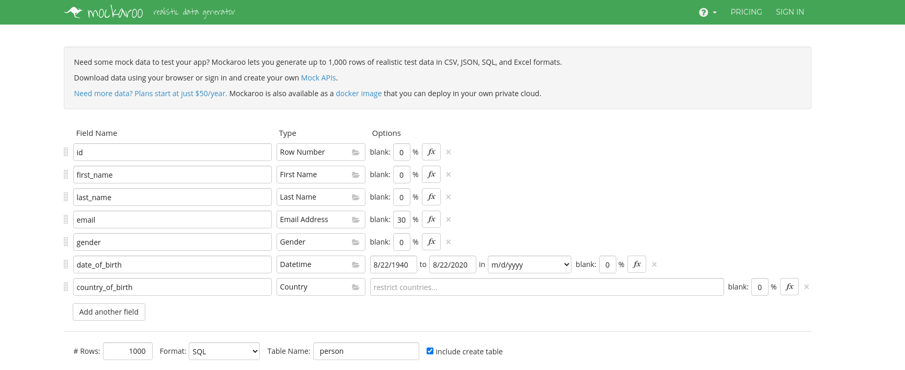

**Connect database container**
```
docker exec -it postgres psql -U postgres
[sakhtar@linux docker-compose-postgres]$ docker exec -it postgres psql -U postgres
psql (12.4)
Type "help" for help.

postgres=# 
```

**List Database**
```
postgres=# \l
                                 List of databases
   Name    |  Owner   | Encoding |  Collate   |   Ctype    |   Access privileges   
-----------+----------+----------+------------+------------+-----------------------
 postgres  | postgres | UTF8     | en_US.utf8 | en_US.utf8 | 
 shamim    | postgres | UTF8     | en_US.utf8 | en_US.utf8 | 
 template0 | postgres | UTF8     | en_US.utf8 | en_US.utf8 | =c/postgres          +
           |          |          |            |            | postgres=CTc/postgres
 template1 | postgres | UTF8     | en_US.utf8 | en_US.utf8 | =c/postgres          +
           |          |          |            |            | postgres=CTc/postgres
(4 rows)

postgres=# 

```
**Create Database**
```
postgres=# CREATE DATABASE test;
CREATE DATABASE
postgres=# 

```
**Drop Database**
```
postgres=# DROP DATABASE test;
CREATE DATABASE
postgres=# 

```
**Connect to Database test**
```
postgres=# \c test
You are now connected to database "test" as user "postgres".
test=# 
```
**Clear the screeen in posgres prompt**

```
\! clear
```

**Create Table person **
```
 CREATE TABLE person (
  first_name VARCHAR(50),
  last_name VARCHAR(50),
  gender VARCHAR(7),
  date_of_birth DATE
);
```

**List Table**
```
postgres=# \d
 public | person | table | postgres

postgres=# 

```

**Describe Table**
```
postgres=# \d person;
 first_name    | character varying(50) |           |          | 
 last_name     | character varying(50) |           |          | 
 gender        | character varying(7)  |           |          | 
 date_of_birth | date                  |           |          | 

postgres=#
```

**Drop Table**
```
DROP TABLE person;
```

**Create Table with constraints**
```
CREATE TABLE person (
   id BIGSERIAL NOT NULL PRIMARY KEY,
   first_name VARCHAR(50) NOT NULL,
   last_name VARCHAR(50) NOT NULL,
   gender VARCHAR(5) NOT NULL,
   date_of_birth DATE NOT NULL,
   email VARCHAR(150)
);
```

**Insert into the table**
```
postgres=# INSERT INTO person (first_name, last_name, gender, date_of_birth) VALUES('Shamim', 'Akhtar', 'Male', '1987-12-02');


postgres=# INSERT INTO person (first_name, last_name, gender, date_of_birth) VALUES('Ali', 'Raza', 'Male', '1984-01-12');


postgres=# INSERT INTO person (first_name, last_name, gender, date_of_birth, email) VALUES('Amir', 'Khan', 'Male', '1986-01-12', 'amirkhan@gmail.com');


postgres=# select * from person;
  1 | Shamim     | Akhtar    | Male   | 1987-12-02    | 
  2 | Ali        | Raza      | Male   | 1984-01-12    | 
  3 | Amir       | Khan      | Male   | 1986-01-12    | amirkhan@gmail.com

postgres=# 
```

**Create mock data**

Create mock data from [here](https://www.mockaroo.com/) as given below and download person.sql


**How to populate sql data to postgres docker container**

Find the name and id of the Docker container hosting the Postgres instance
```
[sakhtar@linux ~]$ docker ps
CONTAINER ID        IMAGE                  COMMAND                  CREATED             STATUS              PORTS                           NAMES
91865223f3e7        dpage/pgadmin4:4.24    "/entrypoint.sh"         19 seconds ago      Up 17 seconds       443/tcp, 0.0.0.0:8080->80/tcp   pgadmin
c4a425bb92c1        postgres:12.4-alpine   "docker-entrypoint.s…"   19 seconds ago      Up 17 seconds       0.0.0.0:5432->5432/tcp          postgres
```

Find the volumes available in the Docker container

```
docker inspect -f '{{ json .Mounts }}' <container_id> | python -m json.tool

[sakhtar@linux ~]$ docker inspect -f '{{ json .Mounts }}' c4a425bb92c1 | python -m json.tool
[
    {
        "Destination": "/var/lib/postgresql/data",
        "Driver": "local",
        "Mode": "rw",
        "Name": "docker-compose-postgres_postgres",
        "Propagation": "",
        "RW": true,
        "Source": "/var/lib/docker/volumes/docker-compose-postgres_postgres/_data",
        "Type": "volume"
    }
]
[sakhtar@linux ~]$
```
In this case, we have /var/lib/postgresql/data as the volume path.

Copy dump into one of the volumes

```
docker cp ./SQL/person.sql postgres:/var/lib/postgresql/data/
```

Now populate sql from postgres cli

```
postgres=# \i /var/lib/postgresql/data/person.sql;
```
****

**SQL Select From**


**Order by**

**Distinct**

**Where Clause and AND**


**Comparison Operators**

**Limit, Offset & Fetch**

**IN**


**Between**
```
test=# SELECT * FROM person WHERE date_of_birth BETWEEN DATE '2019-01-01' AND '2019-12-31';
 id  | first_name |  last_name  |               email               | gender | date_of_birth | country_of_birth 
-----+------------+-------------+-----------------------------------+--------+---------------+------------------
 131 | Marybeth   | Coverley    | mcoverley3m@yale.edu              | Female | 2019-02-28    | Philippines
 164 | Laurianne  | Ferier      | lferier4j@de.vu                   | Female | 2019-02-17    | Portugal
 251 | Catriona   | Tatershall  | ctatershall6y@acquirethisname.com | Female | 2019-11-19    | Russia
 274 | Concettina | Nan Carrow  | cnancarrow7l@newsvine.com         | Female | 2019-06-30    | China
 296 | Marv       | MacCathay   | mmaccathay87@imageshack.us        | Male   | 2019-02-01    | Afghanistan
 316 | Eleanor    | Wasielewicz | ewasielewicz8r@usnews.com         | Female | 2019-07-08    | Indonesia
 423 | Gabe       | Tollerfield | gtollerfieldbq@java.com           | Male   | 2019-10-14    | Russia
 543 | Idelle     | Burgane     | iburganef2@skype.com              | Female | 2019-06-05    | Vietnam
 579 | Rogerio    | Daine       | rdaineg2@gizmodo.com              | Male   | 2019-04-23    | Philippines
 638 | Allayne    | Rowlstone   | arowlstonehp@hatena.ne.jp         | Male   | 2019-04-03    | Thailand
 710 | Ramona     | Kidstone    | rkidstonejp@aol.com               | Female | 2019-04-14    | South Africa
 762 | Birch      | Tebb        | btebbl5@mozilla.com               | Male   | 2019-09-16    | Indonesia
 826 | Darcie     | Verdie      | dverdiemx@bing.com                | Female | 2019-01-25    | Switzerland
 887 | Kerk       | Geraldini   | kgeraldiniom@ucoz.com             | Male   | 2019-10-29    | Ukraine
 968 | Brande     | Goulbourne  | bgoulbourneqv@un.org              | Female | 2019-12-06    | Indonesia
(15 rows)

```
**Like**
```
test=# SELECT * FROM person WHERE email LIKE '%xing.com';
 id  | first_name | last_name |         email         | gender | date_of_birth | country_of_birth 
-----+------------+-----------+-----------------------+--------+---------------+------------------
  41 | Jere       | Bosward   | jbosward14@xing.com   | Male   | 1981-11-22    | Poland
 646 | Bethanne   | Patek     | bpatekhx@xing.com     | Female | 2010-05-09    | United States
 668 | Tine       | Carbonell | tcarbonellij@xing.com | Female | 2005-09-14    | Poland
 798 | Valry      | Smither   | vsmitherm5@xing.com   | Female | 1950-01-06    | Indonesia
 863 | Gabby      | Sharpe    | gsharpeny@xing.com    | Male   | 1951-06-16    | Norway
(5 rows)

test=# 
```
```
test=# SELECT * FROM person WHERE email LIKE '%@google.com';
 id  | first_name | last_name |         email         | gender | date_of_birth | country_of_birth 
-----+------------+-----------+-----------------------+--------+---------------+------------------
 284 | Jasmine    | Minshaw   | jminshaw7v@google.com | Female | 2013-05-15    | China
(1 row)

test=# SELECT * FROM person WHERE email LIKE '%@google.%';
 id  |  first_name  |   last_name    |              email              | gender | date_of_birth |  country_of_birth  
-----+--------------+----------------+---------------------------------+--------+---------------+--------------------
  10 | Charmian     | Lambell        | clambell9@google.com.hk         | Female | 1992-12-31    | Ukraine
  17 | Galen        | Wankling       | gwanklingg@google.com.au        | Male   | 1950-08-12    | China
 100 | Leroi        | Leivers        | lleivers2r@google.co.uk         | Male   | 2003-08-10    | Malaysia
 105 | Marie-jeanne | Kopp           | mkopp2w@google.it               | Female | 1948-09-01    | Indonesia
 146 | Derby        | Biddle         | dbiddle41@google.co.uk          | Male   | 1999-02-20    | Indonesia
 176 | Danyette     | Linskey        | dlinskey4v@google.pl            | Female | 2005-01-09    | South Korea
 202 | Clary        | Brawley        | cbrawley5l@google.de            | Female | 2004-09-17    | China
 230 | Zahara       | Burchett       | zburchett6d@google.com.au       | Female | 1977-08-20    | China
 263 | Deeyn        | Thackray       | dthackray7a@google.es           | Female | 1969-08-13    | Sweden
 284 | Jasmine      | Minshaw        | jminshaw7v@google.com           | Female | 2013-05-15    | China
 287 | Sidnee       | Paulou         | spaulou7y@google.it             | Male   | 1994-06-27    | China
 321 | Joceline     | Baine          | jbaine8w@google.co.jp           | Female | 1956-01-28    | Argentina
 330 | Conrado      | Leeke          | cleeke95@google.pl              | Male   | 2020-05-25    | Indonesia
 387 | Eduino       | Poundsford     | epoundsfordaq@google.fr         | Male   | 1970-03-25    | Philippines
 427 | George       | Lune           | glunebu@google.ca               | Male   | 1988-02-24    | Chile
 470 | Poppy        | Whiskerd       | pwhiskerdd1@google.com.br       | Female | 1975-04-22    | United States
 584 | Sergei       | Mustin         | smusting7@google.pl             | Male   | 1997-02-05    | Ukraine
 593 | Sinclare     | Jimson         | sjimsongg@google.fr             | Male   | 1995-12-26    | Indonesia
 610 | Phillie      | Fearnill       | pfearnillgx@google.com.hk       | Female | 1976-10-09    | China
 612 | Danika       | aManger        | damangergz@google.es            | Female | 2000-01-26    | United States
 669 | Budd         | Rodger         | brodgerik@google.pl             | Male   | 1973-07-09    | Greece
 678 | Leah         | Lidyard        | llidyardit@google.ca            | Female | 2020-01-27    | Vietnam
 694 | Vassily      | Alelsandrovich | valelsandrovichj9@google.com.au | Male   | 1979-07-04    | Sweden
 695 | Mendie       | Cambden        | mcambdenja@google.co.jp         | Male   | 2020-04-12    | Honduras
 728 | Archambault  | Demcik         | ademcikk7@google.es             | Male   | 2010-11-11    | Brazil
 732 | Belia        | Nortcliffe     | bnortcliffekb@google.ru         | Female | 2005-08-04    | Dominican Republic
 742 | Meier        | Girke          | mgirkekl@google.ca              | Male   | 1948-10-07    | Portugal
 752 | Darrell      | Ciobutaro      | dciobutarokv@google.it          | Male   | 1973-07-07    | China
 916 | Mallissa     | Mangan         | mmanganpf@google.com.br         | Female | 1997-11-14    | Poland
 936 | Francoise    | Filchakov      | ffilchakovpz@google.de          | Female | 2006-01-16    | Azerbaijan
 942 | Herc         | Ruit           | hruitq5@google.co.uk            | Male   | 2005-02-18    | Serbia
 967 | Hatty        | Martynka       | hmartynkaqu@google.nl           | Female | 2002-04-24    | Bahrain
 979 | Goraud       | Vaudrey        | gvaudreyr6@google.cn            | Male   | 1958-04-25    | Canada
 981 | Ogdon        | Bosley         | obosleyr8@google.pl             | Male   | 1949-04-11    | France
(34 rows)

test=# 
```
**Single character with underscore (_)**
```
test=# SELECT * FROM person WHERE email LIKE '______@%';
 id  | first_name | last_name |           email            | gender | date_of_birth | country_of_birth 
-----+------------+-----------+----------------------------+--------+---------------+------------------
  15 | Armando    | Hume      | ahumee@topsy.com           | Male   | 2001-04-30    | Ukraine
  30 | Lorens     | Kirk      | lkirkt@eepurl.com          | Male   | 2013-10-15    | Indonesia
 239 | Jerrine    | Say       | jsay6m@hubpages.com        | Female | 1965-08-12    | United States
 261 | Gerardo    | Axe       | gaxe78@va.gov              | Male   | 2015-05-10    | Kuwait
 295 | Carmel     | Esh       | cesh86@pinterest.com       | Female | 1959-12-02    | Sweden
 341 | Enos       | Odo       | eodo9g@naver.com           | Male   | 1968-04-11    | Russia
 436 | Emiline    | Yon       | eyonc3@opera.com           | Female | 2003-10-15    | Sweden
 693 | Noami      | Raw       | nrawj8@cdc.gov             | Female | 1979-12-30    | Luxembourg
 823 | Chan       | Mix       | cmixmu@guardian.co.uk      | Male   | 1949-03-21    | Indonesia
 868 | Leanora    | Roe       | lroeo3@bing.com            | Female | 1951-01-21    | Poland
 975 | Elisabet   | Dix       | edixr2@cargocollective.com | Female | 1965-04-04    | Brazil
(11 rows)

test=# 
```
**iLike**
```
test=# SELECT * FROM person WHERE country_of_birth LIKE 'a%';
 id | first_name | last_name | email | gender | date_of_birth | country_of_birth 
----+------------+-----------+-------+--------+---------------+------------------
(0 rows)

test=# SELECT * FROM person WHERE country_of_birth ILIKE 'a%';
 id  | first_name | last_name  |             email              | gender | date_of_birth | country_of_birth 
-----+------------+------------+--------------------------------+--------+---------------+------------------
   5 | Isaiah     | Titmuss    | ititmuss4@epa.gov              | Male   | 2015-04-25    | Albania
  26 | Jacquelyn  | Mowat      | jmowatp@blinklist.com          | Female | 1960-07-23    | Albania
  34 | Thaine     | Oades      | toadesx@cpanel.net             | Male   | 1964-03-04    | Argentina
  49 | Lorita     | Allcoat    | lallcoat1c@unblog.fr           | Female | 1998-04-02    | Argentina
  81 | Minni      | Roocroft   | mroocroft28@thetimes.co.uk     | Female | 2004-12-17    | Armenia
  85 | Lalo       | Alden      | lalden2c@nymag.com             | Male   | 2007-07-13    | Argentina
 214 | Ramon      | Grafom     | rgrafom5x@indiegogo.com        | Male   | 2005-01-26    | Argentina
 255 | Effie      | Kluss      | ekluss72@phoca.cz              | Female | 2005-04-01    | Angola
 291 | John       | Reace      | jreace82@taobao.com            | Male   | 1960-09-13    | Albania
 296 | Marv       | MacCathay  | mmaccathay87@imageshack.us     | Male   | 2019-02-01    | Afghanistan
 297 | Burty      | Bester     | bbester88@ezinearticles.com    | Male   | 1953-11-21    | Argentina
 304 | Charo      | Loxdale    | cloxdale8f@drupal.org          | Female | 1997-12-08    | Argentina
 321 | Joceline   | Baine      | jbaine8w@google.co.jp          | Female | 1956-01-28    | Argentina
 384 | Obidiah    | Dallemore  | odallemorean@hostgator.com     | Male   | 2005-04-27    | Afghanistan
 521 | Wallis     | Gravenell  | wgravenelleg@yolasite.com      | Female | 1965-11-02    | Afghanistan
 550 | Herbie     | Gummie     | hgummief9@spiegel.de           | Male   | 2013-10-04    | Argentina
 553 | Chev       | Rutigliano | crutiglianofc@newyorker.com    | Male   | 1964-05-07    | Argentina
 664 | Dionne     | Costy      | dcostyif@discuz.net            | Female | 1960-09-24    | Argentina
 670 | Cobb       | Rawlin     | crawlinil@jalbum.net           | Male   | 1992-02-21    | Armenia
 714 | Franni     | Proger     | fprogerjt@tamu.edu             | Female | 1949-08-07    | Afghanistan
 736 | Shirline   | Chaloner   | schalonerkf@sfgate.com         | Female | 1999-02-02    | Azerbaijan
 763 | Egor       | Clemes     | eclemesl6@hubpages.com         | Male   | 1999-08-03    | Argentina
 816 | Kennett    | Lembrick   | klembrickmn@amazon.co.uk       | Male   | 1982-11-18    | Afghanistan
 878 | Dorey      | Hunnicot   | dhunnicotod@wikipedia.org      | Female | 1948-12-18    | Argentina
 883 | Alikee     | Itzakson   | aitzaksonoi@bbc.co.uk          | Female | 2016-11-21    | Argentina
 886 | Crichton   | Girth      | cgirthol@opera.com             | Male   | 1989-08-14    | Argentina
 905 | Taddeo     | Staveley   | tstaveleyp4@simplemachines.org | Male   | 1994-10-25    | Afghanistan
 930 | Lindon     | Goldie     | lgoldiept@dmoz.org             | Male   | 1982-06-04    | Afghanistan
 936 | Francoise  | Filchakov  | ffilchakovpz@google.de         | Female | 2006-01-16    | Azerbaijan
 938 | Cecilia    | Bambury    | cbamburyq1@imgur.com           | Female | 2006-05-12    | Argentina
 952 | Silvano    | Commuzzo   | scommuzzoqf@accuweather.com    | Male   | 1995-03-28    | Argentina
 970 | Andres     | Rumbold    | arumboldqx@ibm.com             | Male   | 1978-09-14    | Armenia
 983 | Mina       | Alcorn     | malcornra@redcross.org         | Female | 2001-08-31    | Armenia
(33 rows)

test=# 
```
**Group By**

**Group By Having**

**Adding New Table And Data Using Mockaroo**

**Calculating Min, Max & Average**

**Sum**


**Basics of Arithmetic Operators**

 **Arithmetic Operators (ROUND)**

 **Alias**

**Coalesce**

**NULLIF**

**Timestamps And Dates Course**

 **Adding And Subtracting With Dates**

 **Extracting Fields From Timestamp**

 **Age Function**

 **What Are Primary Keys**

 **Understanding Primary Keys**

 **Adding Primary Key**

 **Unique Constraints**

 **Check Constraints**

 **How to Delete Records**

 **How to Update Records**

 **On Conflict Do Nothing**

 **Upsert**

**What Is A Relationship/Foreign Keys**

**Adding Relationship Between Tables**

**Updating Foreign Keys Columns**

**Inner Joins**

**Left Joins**

**Deleting Records With Foreign Keys**

**Exporting Query Results to CSV**

**Serial & Sequences**

**Extensions**

**Understanding UUID Data Type**

**UUID As Primary Keys**


